<!--
  GitHub Profile README
  Repository name must exactly match your GitHub username: TheSangamX
-->

<div align="center">


<br/>

<a href="https://sangamgupta.in">
  
</a>
<a href="https://linkedin.com/in/thesangamx">
  
</a>
<a href="mailto:contact@sangamgupta.in">
  
</a>
<a href="https://github.com/TheSangamX">
  
</a>
<a href="https://x.com/TheSangamX">
  
</a>

<br/><br/>


<br/><br/>

[](#-featured-projects)
[](#-featured-projects)
[](#credit-risk-predictor)
[](#student-marks-predictor)

</div>

---

<div align="center">

```text
┌─────────────────────────────────────────────────────────────────────────────┐
│  ENGINEERING PATH                                                           │
│                                                                             │
│  DATA  →  MODEL  →  API  →  APPLICATION  →  CLOUD  →  PRODUCTION          │
└─────────────────────────────────────────────────────────────────────────────┘
```

</div>

# `$ whoami`

I'm a **Computer Engineering student and aspiring AI/ML Engineer** focused on taking ideas beyond notebooks.

I am interested in the complete engineering path around a model—not only training it, but understanding how it can be served, connected to applications, deployed, and improved.

> **The direction:** `Data → Model → API → Application → Deployment → Iteration`

```yaml
identity:
  name: Sangam Gupta
  role: Aspiring AI/ML Engineer | Data Science Enthusiast
  background: Computer Engineering
  based_in: Mumbai, India

focus:
  - Machine Learning & applied Data Science
  - Model serving with FastAPI and Flask
  - API-driven applications
  - Cloud deployment with AWS EC2
  - Algorithmic trading & quantitative finance
  - Web + Android delivery from shared backend systems

currently_learning:
  - DevOps
  - Cloud Infrastructure
  - Deep Learning

philosophy: "Depth over breadth — real projects over endless tutorials."
```

<br/>

### `> What I'm actively building toward`

```text
✓ Understand ML beyond model.fit()
✓ Serve models through production-style APIs
✓ Connect one backend to multiple clients
✓ Learn deployment and infrastructure
✓ Strengthen SQL, statistics and ML fundamentals
✓ Build systems that people can actually use
```

---

# `$ tree engineering/`

```text
engineering/
│
├── machine-learning/
│   ├── data-analysis/
│   ├── model-training/
│   └── evaluation/
│
├── backend/
│   ├── FastAPI/
│   ├── Flask/
│   └── REST-APIs/
│
├── applications/
│   ├── Streamlit/
│   └── Android / Jetpack Compose/
│
└── deployment/
    ├── AWS EC2/
    ├── Cloud/
    └── Production workflows/
```

---

# `$ ./tech-stack.sh`

<div align="center">

### ◈ LANGUAGES & CORE


<br/><br/>

### ◈ MACHINE LEARNING & DATA


<br/><br/>

### ◈ BACKEND, APIs & APPLICATIONS


<br/><br/>

### ◈ DATA, CLOUD & TOOLS


</div>

---

<a id="featured-projects"></a>

# `$ ls -la featured-projects/`

> **Not notebooks left behind after training. These are projects built around the model, the interface, and the delivery layer.**

<table>
<tr>

<td width="50%" valign="top">

## 🎓 Student Marks Predictor

**ONE ML MODEL. MULTIPLE DELIVERY LAYERS.**

A FastAPI backend deployed on AWS EC2 powers a live Streamlit application and a native Kotlin/Jetpack Compose Android client.

**DELIVERY STACK**

- 🌐 Streamlit web application
- ⚙️ REST API with Swagger / OpenAPI documentation
- ☁️ Backend running as a `systemd` service on AWS EC2
- 📱 Android client using Kotlin, Jetpack Compose, Retrofit and Material 3

`Python` · `FastAPI` · `Scikit-learn` · `Kotlin` · `AWS EC2` · `Streamlit`

### [→ VIEW REPOSITORY](https://github.com/TheSangamX/student-marks-predictor)

</td>

<td width="50%" valign="top">

## 🛡️ NewsIntel

**AI-POWERED FAKE NEWS DETECTION WITH A FULL APPLICATION LAYER.**

The project combines TF-IDF and a Passive Aggressive Classifier with authentication, a Supabase-backed verification history, and a deployed user interface.

**SYSTEM FEATURES**

- 🌐 Deployed web application
- 🔐 Google Authentication
- 🗄️ Supabase PostgreSQL verification history
- 🧠 NLP pipeline from text cleaning through TF-IDF

`Python` · `Flask` · `NLP` · `Scikit-learn` · `Supabase`

### [→ VIEW REPOSITORY](https://github.com/TheSangamX/NewsIntel)

</td>

</tr>

<tr>

<td width="50%" valign="top">

<a id="credit-risk-predictor"></a>

## 💳 Credit Risk Predictor

**A LENDING-RISK CLASSIFICATION PROJECT BUILT AROUND MEASURABLE OUTPUT AND INTERPRETABILITY.**

Built around `HistGradientBoostingClassifier` with a custom **15% decision threshold**.

**MODEL SNAPSHOT**

- 📊 **85.17% accuracy**
- 📈 **75.99% ROC-AUC**
- 🔍 Top-20 feature-importance breakdown
- 🖥️ Real-time default-probability prediction

`Python` · `Scikit-learn` · `Streamlit` · `Joblib`

### [→ VIEW REPOSITORY](https://github.com/TheSangamX/credit_risk_predictor)

</td>

<td width="50%" valign="top">

## 💧 AquaSense AI

**RESERVOIR INTELLIGENCE AND PREDICTION PLATFORM.**

A multi-page Streamlit dashboard built for a hackathon, using multiple ML approaches and automated flood/drought risk scoring.

**PLATFORM FEATURES**

- 🌐 Live dashboard
- 🤖 Linear Regression and Random Forest comparison
- ⚠️ Flood / drought risk scoring
- 📊 Action-oriented recommendations

`Streamlit` · `Plotly` · `Scikit-learn` · `Pandas`

### [→ VIEW REPOSITORY](https://github.com/TheSangamX/aquasenseai)

</td>

</tr>
</table>

<br/>

## `Project Delivery Matrix`

| Project | ML / Core | Backend | Interface | Deployment |
|---|---|---|---|---|
| 🎓 Student Marks Predictor | Scikit-learn | FastAPI | Streamlit + Android | AWS EC2 |
| 🛡️ NewsIntel | TF-IDF + Passive Aggressive Classifier | Flask | Web App | Live Domain |
| 💳 Credit Risk Predictor | HistGradientBoostingClassifier | — | Streamlit | Live App |
| 💧 AquaSense AI | Linear Regression + Random Forest | — | Streamlit | Live App |

<div align="center">

> **The goal is simple: learn the model, understand the engineering around it, and ship something usable.**

</div>

---

# `$ cat engineering-philosophy.md`

```text
I am especially interested in the part after:

    model.fit()

How does the model get served?
How does an application communicate with it?
Where does user data go?
How is the service deployed?
How can the same backend support multiple clients?

That is the direction I am actively exploring:

ML → APIs → Applications → Cloud → Production
```

---

# `$ cat currently.md`

```diff
+ Deepening the ML → API → Cloud deployment pipeline
+ Exploring algorithmic trading with Python and market-data APIs
+ Strengthening SQL, statistics, and production-grade ML fundamentals
+ Learning DevOps and cloud infrastructure alongside application deployment
```

---

# `$ echo $GOAL`

<div align="center">

```text
LEARN DEEPLY
     ↓
BUILD REAL PROJECTS
     ↓
DEPLOY
     ↓
IMPROVE
     ↓
REPEAT
```

### THE LONG-TERM MINDSET

**Don't collect tutorials. Build understanding.**  
**Don't just train models. Learn how to ship systems.**  
**Don't optimize for appearing technical. Optimize for becoming technical.**

</div>

---

# `$ ./contribution-graph.sh`

<div align="center">

<picture>
  <source media="(prefers-color-scheme: dark)" srcset="https://raw.githubusercontent.com/TheSangamX/TheSangamX/output/github-contribution-grid-snake-dark.svg" />
  <source media="(prefers-color-scheme: light)" srcset="https://raw.githubusercontent.com/TheSangamX/TheSangamX/output/github-contribution-grid-snake.svg" />
  
</picture>

<br/>

<sub>Auto-generated through GitHub Actions from this profile repository.</sub>

</div>

---

# `$ ./github-stats.sh`

<div align="center">




<br/><br/>

<sub>Stats are generated and committed by GitHub Actions.</sub>

</div>

---

# `$ ./contact.sh`

<div align="center">

[](https://sangamgupta.in)
[](https://linkedin.com/in/thesangamx)
[](https://github.com/TheSangamX)
[](https://medium.com/@TheSangamX)
[](https://thesangamx.blogspot.com/)
[](https://x.com/TheSangamX)

<br/><br/>

**Open to connecting with people building interesting things in AI, ML, data, software, and technology.**

</div>

---

<div align="center">


<br/><br/>


</div>
